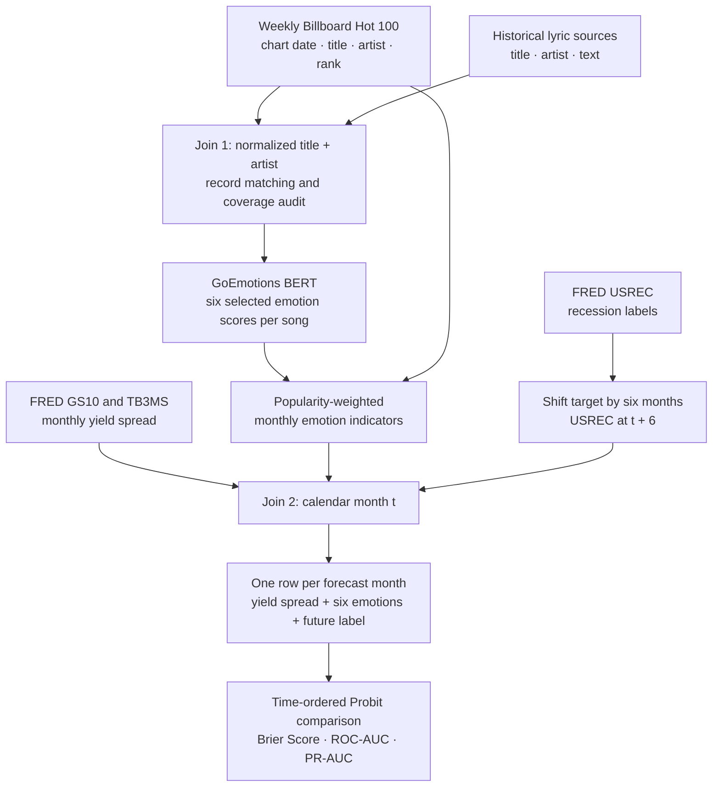

# Can Popular Music Predict U.S. Recessions?

**Evaluating music-derived emotion indicators as alternative data for six-month-ahead U.S. recession forecasting**

**NYU Courant | Predictive Analytics | Fall 2026 | Team 5**  
**Team:** Keefer Wu · Nathan Starkman · Kiran Reddy Bhumireddy

> **Project status:** Research design and data-source identification are underway. Historical lyrics availability, permissions, song matching, and final coverage are **not yet verified**. The models and results described below are **planned**, not completed.

## Overview

Can emotions expressed in popular music help forecast the U.S. economy? This project investigates whether **popularity-weighted lyrical emotion indicators** improve predictions of U.S. recession status **six months ahead**, beyond a standard economic baseline based on the Treasury yield curve.

We will compare two **Probit** models on the same chronological test periods:

- **Baseline (Model A):** 10-year minus 3-month Treasury yield spread.
- **Extended (Model B):** The same yield spread **plus six monthly lyrical emotion features**.

The goal is to measure **incremental predictive value**, not to claim that music causes recessions. A null or negative result is a valid research outcome.

## Research Question

> Do popularity-weighted emotions in popular-song lyrics improve out-of-sample forecasts of U.S. recession status six months ahead, compared with a yield-curve-only Probit model?

For a forecast made using information available at month $t$, the binary prediction target is:

$$
Y_t = \mathrm{USREC}_{t+6},
$$

where $Y_t=1$ means the U.S. is classified as being **in a recession six calendar months later**. This is a **recession-status** target, not a prediction of whether a new recession begins at any time within the next six months.

**Primary evaluation metric:** Out-of-sample **Brier Score** (lower is better).  
**Additional metrics:** ROC-AUC and PR-AUC; a three-month horizon may be explored as a sensitivity analysis.

## Data Sources

| Data | Source | Frequency / role | Status |
|---|---|---|---|
| U.S. recession indicator (`USREC`) | [FRED — USREC](https://fred.stlouisfed.org/series/USREC) | Monthly binary recession label; future target | Source identified |
| 10-year Treasury yield (`GS10`) | [FRED — GS10](https://fred.stlouisfed.org/series/GS10) | Monthly long-term yield | Source identified |
| 3-month Treasury bill rate (`TB3MS`) | [FRED — TB3MS](https://fred.stlouisfed.org/series/TB3MS) | Monthly short-term yield | Source identified |
| Billboard Hot 100 | [Historical weekly Billboard archive](https://github.com/mhollingshead/billboard-hot-100) | Chart date, song, artist, rank | Historical source identified; matching pending |
| Historical lyrics, candidate 1 | [Foramitti et al. (2025) OSF repository](https://osf.io/2k7ut/) | Candidate research files associated with Billboard lyrics, 1973–2023 | File contents and reuse permissions to verify |
| Historical lyrics, candidate 2 | [Kaggle: Top 100 Songs & Lyrics](https://www.kaggle.com/datasets/brianblakely/top-100-songs-and-lyrics-from-1959-to-2019) | Candidate year-end song and lyrics lookup | Reported dataset size is **not** verified usable coverage |
| GoEmotions annotations | [Official Google Research repository](https://github.com/google-research/google-research/tree/master/goemotions) | Emotion taxonomy and original Reddit annotations | Methodological resource |
| GoEmotions BERT checkpoint | [Hugging Face model](https://huggingface.co/monologg/bert-base-cased-goemotions-original) | Pretrained text emotion scoring | Proposed model; lyric validation pending |
| Audio-features fallback | [TidyTuesday: Billboard and Spotify](https://github.com/rfordatascience/tidytuesday/tree/main/data/2021/2021-09-14) | Candidate precomputed audio features | Backup; coverage and permissions to verify |

**Target historical period:** **1959–2023**, conditional on a viable matched lyrics sample; **1973–2023** is a potential narrower period aligned with Foramitti et al.'s work. These are *targets*, not confirmed complete study samples.

### Important lyrics limitation

Lyrics are often copyrighted and can be difficult to obtain in bulk. **Year-end hit lists are potential lyrics-lookup sources, not valid replacements for historical weekly charts.** Selecting songs based on their eventual year-end rankings would use future chart behavior when constructing earlier forecasts. We will evaluate matched-song coverage against the actual weekly chart population, including variation across months and historical periods.

## Data Integration Pipeline

The data-preparation workflow follows **CRISP-DM**, particularly **data integration (data fusion), cleaning, feature construction, and aggregation**.

### Join 1: Weekly Billboard charts ↔ song lyrics

- **Proposed join key:** Canonicalized song title and artist name, with manual checks for ambiguous matches, remixes, alternate spellings, and duplicates.
- A song's lyrics can be scored once, then reused for each dated chart appearance of that song.
- Unmatched weekly chart entries remain in a **coverage audit**; they are not silently treated as emotionally neutral.
- Lyrics coverage, permitted use, and possible year-end selection bias determine whether this approach is feasible.

### NLP: Lyrics → emotion scores

GoEmotions provides **27 emotion categories plus neutral**. We propose selecting **six native labels**, chosen before inspecting recession outcomes:

**Joy · Sadness · Fear · Anger · Nervousness · Optimism**

The proposed model is a pretrained **multi-label BERT classifier**, rather than a model trained from scratch. Long lyrics may require chunking, followed by a documented rule for pooling chunk scores into one score per song.

**Domain-shift check:** GoEmotions was trained on **Reddit comments**, not lyrics. We plan a small manual review of predictions on a sample of songs before trusting the emotion indicators. The precise sampling and agreement protocol will be documented during implementation.

### Aggregate: Weekly charts → monthly indicators

We will use chart rankings to give more popular chart entries more influence. One simple **proposed**, not yet finalized, rank weight is:

$$
w_i = 101 - \operatorname{rank}_i.
$$

For emotion $k$ and forecast month $t$:

$$
E_{t,k} =
\frac{\sum_{i\in \mathcal C_t^{\mathrm{matched}}}w_i e_{i,k}}
     {\sum_{i\in \mathcal C_t^{\mathrm{matched}}}w_i},
$$

where $\mathcal C_t^{\mathrm{matched}}$ contains only **eligible chart observations known by the forecast cutoff** for month $t$. We will report match coverage in both song counts and chart-weight terms. The aggregation window and handling of weeks crossing month boundaries will be specified before modeling.

### Join 2: Monthly music features ↔ FRED

Compute the yield spread:

$$
S_t = \mathrm{GS10}_t-\mathrm{TB3MS}_t.
$$

Join monthly music indicators $E_{t,k}$ and spread $S_t$ **by calendar month**, then construct $Y_t=\mathrm{USREC}_{t+6}$. The modeling table has **one row per forecast month**.

For a truly real-time forecasting study, both publication timing and historical revisions of macroeconomic data must be considered. NBER recession dates are retrospective labels and should not be treated as instantly known during historical training.

## Modeling Approach

**Model A — Yield-curve Probit:**

$$
\Pr(Y_t=1\mid S_t) = \Phi(\beta_0+\beta_1 S_t).
$$

**Model B — Yield-curve + music Probit:**

$$
\Pr(Y_t=1\mid S_t,\mathbf E_t) =
\Phi\left(\beta_0+\beta_1S_t+\sum_{k=1}^{6}\gamma_kE_{t,k}\right).
$$

Here $\Phi$ is the standard normal CDF. The six music terms are the only planned added inputs in the main comparison. We will keep the feature set small and consider regularization if necessary to reduce overfitting.

### Evaluation protocol

1. **Use chronological expanding-window evaluation**, not random train/test shuffling.
2. Train each forecast using only predictors available at that date and outcomes that would have matured by the training cutoff (including the six-month horizon).
3. Evaluate **both models on identical test months**.
4. Compare the **Brier Score** as the primary metric:

   $$\operatorname{BS}=\frac{1}{N}\sum_{t=1}^{N}(\hat p_t-Y_t)^2.$$

5. Report ROC-AUC and PR-AUC as supporting discrimination metrics, with caution where test periods contain few or no recession observations.
6. Estimate uncertainty using **block-bootstrap confidence intervals**, while acknowledging that the small number of distinct recession episodes can make these estimates unstable.

The historical sample has relatively few independent recession episodes; strong claims about generalizable improvements would therefore be unwarranted. **No modeling results are available yet.**

## Project Plan

| Phase | Planned work | Decision / deliverable |
|---|---|---|
| **1. Sources + baseline** | Validate datasets, rights, monthly coverage; build FRED target and baseline Probit | **Go/no-go on lyrics at end of Phase 1** |
| **2. Emotion features** | Match lyrics; run GoEmotions; review predictions; aggregate music scores | Monthly music feature table |
| **3. Backtesting** | Join monthly tables; walk-forward comparison; assess uncertainty and leakage | Out-of-sample evaluation |
| **4. Final paper** | Synthesize related work, methods, findings, limitations | Reproducible report and conclusions |

**Fallback:** If usable lyric coverage is inadequate, assess historical **audio features** (such as valence and energy) from an appropriately licensed precomputed dataset. This would be a documented change to the music-feature measurement, **not** a claim that lyric-based results were obtained.

Three workstreams run in parallel: **economic baseline**, **music/NLP pipeline**, and **data integration/evaluation**, with shared validation and writing.

## Related Work

1. **Estrella & Mishkin (1998)** — [Recession forecasting with financial indicators and Probit](https://www.nber.org/papers/w5379). Foundation for the economic baseline.
2. **Zullow (1991)** — [Popular-song lyric pessimism and economic changes](https://www.sciencedirect.com/science/article/abs/pii/016748709190029S). Early motivation for testing music as an economic signal.
3. **de Lucio & Palomeque (2023)** — [Music preferences and business cycles](https://doi.org/10.1007/s10824-022-09454-7). Links music behavior and macroeconomic conditions; our focus is future forecasting.
4. **Musthyala et al. (2024)** — [AI framework for predicting Grammy winners](https://ieeexplore.ieee.org/document/10607237). Example of combining music-related features for a predictive task.
5. **Foramitti et al. (2025)** — [Billboard lyrics, stress, negativity, simplicity, and societal crises, 1973–2023](https://www.nature.com/articles/s41598-025-28327-5). Most directly related historical Billboard lyric-analysis study.

**NLP method reference:** [Demszky et al. (2020), *GoEmotions: A Dataset of Fine-Grained Emotions*](https://aclanthology.org/2020.acl-main.372/).

## Reproducibility and Repository Status

This repository documents a **proposed research pipeline**. Dataset ingestion, song-matching rules, model training, backtesting scripts, experimental results, and a final reproducibility manifest will be added as implementation progresses. We will document any departures from this plan, including study-period restrictions and data-source substitutions.

**Data rights:** Do not commit copyrighted full lyrics or redistribution-restricted datasets to the repository. Only share data, derived features, or metadata when the relevant terms permit it. Source datasets should be obtained from their original publishers or repositories.

---

*Prepared for the NYU Courant Predictive Analytics course, Fall 2026. Research design and source availability remain subject to verification.*
